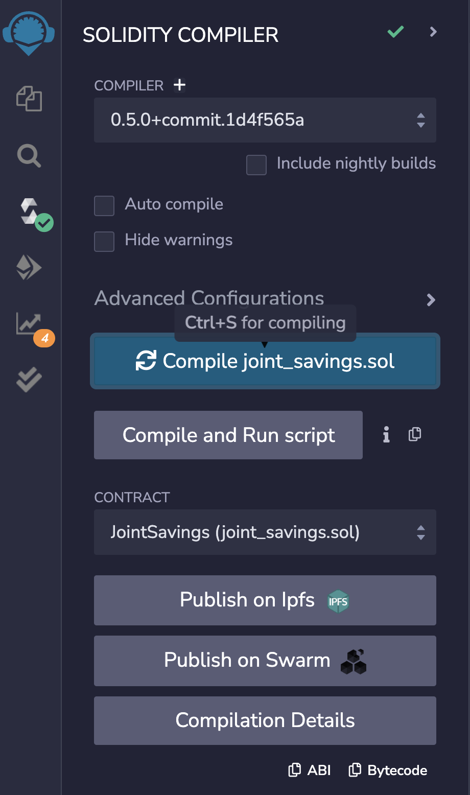
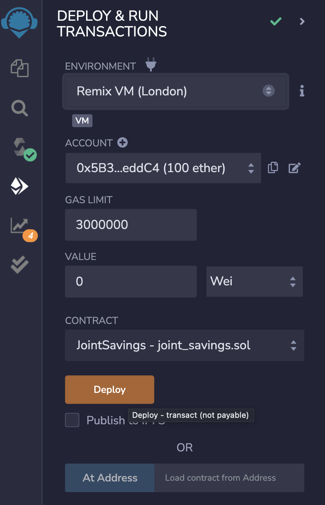
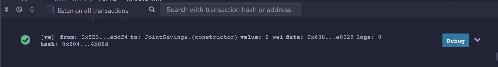

# Smart Contract Savings Account

Smart Contract written in Solidity that runs on an Ethereum-compatible blockchain that connects financial institutions. The contract accepts two user addresses that can control a joint savings account. The smart contract uses ether management functions to implement a financial institutions' requirements for providing features of a dual savings account.

----

## Technologies
This application is written in the Solidity programming language. The code is edited in Remix IDE. This contract uses the 0.5.0 compiler verison. 

----

## Installation Guide
The code in this contract does not use any outside libraries or modules. 

For the user to compile the code correctly, they must make sure the compiler version in the code matches the compiler version on Remix IDE. 

----

## Usage

**The program is comprised of 3 main parts:**

### Create a Joint Savings Account Contract in Solidity

Complete the following steps:

1. Define a new contract named `JointSavings` and define the following variables within:

    - Two variables of type `address payable` named `accountOne` and `accountTwo`

    - A variable of type `address public` named `lastToWithdraw`

    - Two variables of type `uint public` named `lastWithdrawAmount` and `contractBalance`

2. Define a function named `withdraw` that accepts two arguments: `amount` of type `uint` and `recipient` of type `payable address`. In this function, code the following:

    - Define a `require` statement that checks if `recipient` is equal to either `accountOne` or `accountTwo`. If it isn’t, the require statement returns the “You don't own this account!” text.

    - Define a `require` statement that checks if `balance` is sufficient for accomplishing the withdrawal operation. If there are insufficient funds, it returns the “Insufficient funds!” text.

    - Add an `if` statement to check if `lastToWithdraw` is not equal (`!=`) to `recipient`. If it’s not equal, set it to the current value of `recipient`.

    - Call the `transfer` function of the `recipient`, and pass it the `amount` to transfer as an argument.

    - Set `lastWithdrawAmount` equal to `amount`.

    - Set the `contractBalance` variable equal to the balance of the contract by using `address(this).balance` to reflect the new balance of the contract.

3. Define a `public payable` function named `deposit`. In this function, code the following:

    - Set the `contractBalance` variable equal to the balance of the contract by using `address(this).balance`

4. Define a `public` function named `setAccounts` that takes two `address payable` arguments, named `account1` and `account2`. In the body of the function, set the values of `accountOne` and `accountTwo` to `account1` and `account2`, respectively.

5. Add a fallback function so that your contract can store ether that's sent from outside the deposit function

### Compile and Deploy Contract in JavaScript VM

Complete the following steps:

1. Navigae to the "Compile" pane. Compile the code using the matching compiler version.

    

2. Navigate to the "Deploy & Run Transactions" pane. Make sure the "JavaScript VM" is selected as the environment. *In newer versions of Remix IDE, this may be renamed to "Remix VM"*

    

3. Click the Deploy button. To confirm it has been successfully deployed, navigate to the terminal window near the bottom of the pane. It should look something like this:

    

### Interact with Deployed Smart Contract 

Now that the contract is deployed, the user can test the functionality. 

----

## Contributors

Arlie Jones

[E-mail](arliejones98@gmail.com)  |  [LinkedIn](https://www.linkedin.com/in/arlie-jones-020092159/)

----

## License

None